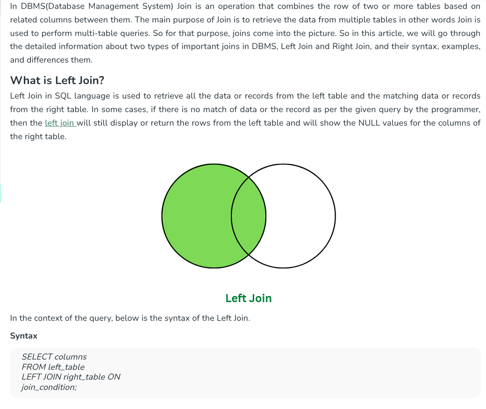
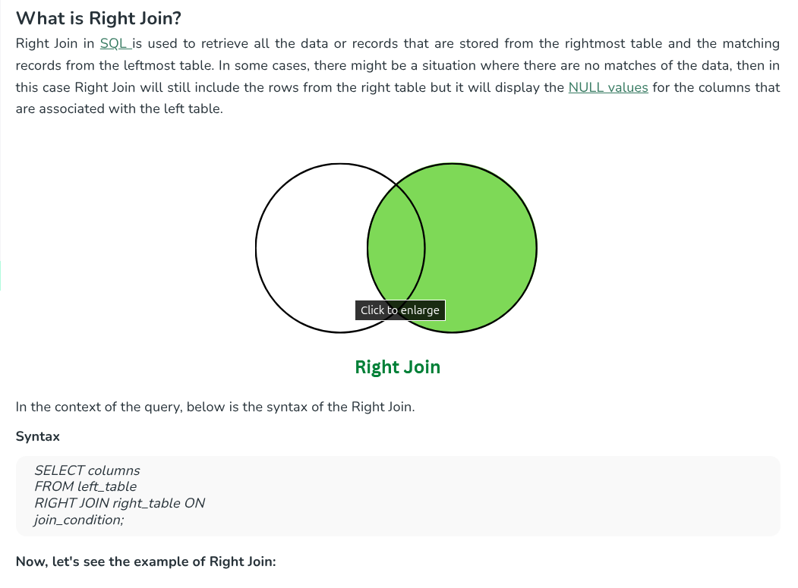

# JOINS

## Inner Join

#### Combine rows from two tables based on a related column. 

Eg. Orders link to users through user_id. INNER JOIN returns only rows where there's a match in both tables. orders.user_id links to users.id.

#### Join orders with users. Select order id, user name, and order quantity.
```
SELECT o.id, u.name, o.quantity FROM users u INNER JOIN orders o ON u.id = o.user_id
```

## Left Join

#### Get all rows from the left table, plus matching rows from right table. 

Eg. Shows products even without reviews. LEFT JOIN keeps all products (left table), showing NULL for rating when there's no review. Only 12 of 20 products have reviews.

#### Left join products with reviews. Select product name and review rating. Include products with no reviews.

```
SELECT p.name, r.rating FROM products p LEFT JOIN reviews r ON p.id = r.product_id
```



## Right Join

#### Get all rows from the right table, plus matching rows from left table. Opposite of LEFT JOIN.

RIGHT JOIN keeps all reviews (right table). Since every review has a product.

#### Right join reviews with products. Select product name and review comment.

```
SELECT p.name, r.comment FROM products p RIGHT JOIN reviews r ON r.product_id = p.id
```



## Self Join

#### Join a table with itself. Useful for hierarchical data like employee-manager relationships.

Self JOIN uses aliases to treat one table as two. employees.manager_id references employees.id for the manager.

#### Join employees with themselves to show each employee and their manager name. Select employee name and manager name.

```
SELECT e1.name employee_name, e2.name manager_name FROM employees e1 JOIN employees e2 ON e1.manager_id = e2.id
```

## Join Multiple tables

#### Join more than two tables together. Orders link to both users and products.

Chain multiple JOINs together. Each order connects a user to a product. We have 25 orders.

#### Join orders with users and products. Select order id, user name, and product name.

```
SELECT o.id, u.name, p.name FROM users u JOIN orders o ON o.user_id = u.id JOIN products p ON o.product_id = p.id
```

> HINT: Join Table Name On Condition Join Table Name On Condition

## Join with Where

#### Filter joined results. Combine the power of JOINs with WHERE conditions.

After joining tables, use WHERE to filter the combined data. This finds orders placed by US customers only.

#### Join orders with users, but only show orders from users in 'USA'. Select order id, user name, and country.

```
SELECT o.id, u.name, u.country FROM users u JOIN orders o ON u.id = o.user_id WHERE u.country = 'USA'
```