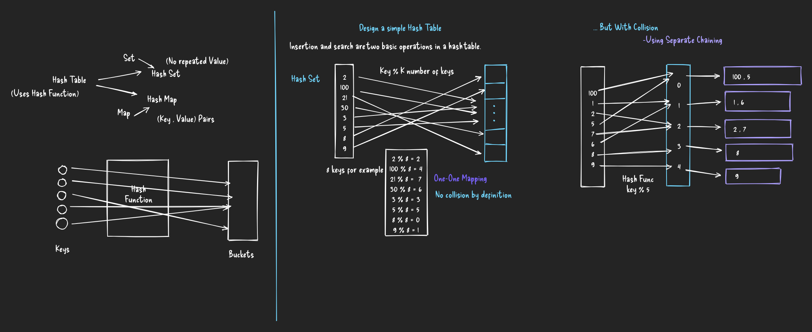

# Hash Table

## The Principle:

The principle of Hash Table is to use a Hash Function to ```map keys to buckets```.

1. When we insert a new key, the hash function will decide which bucket the key should be assigned and the key will be stored in the corresponding bucket.

2. When we search a key, the hash table will use that same hash function to find the bucket and search for the key in that bucket only.

## To Design a Hash Table

### Hash Function
    - The Hash Function will depend on the range of Key-Values and the number of buckets
    - The idea is to try to assign the key to the bucket as uniformly as possible.
    
### Collision Resolution
    - An ideal Hash Function would have perfect one-one mapping, there will be no collision but that is not the case.
    - When two keys are assigned to the same bucket, that is a collision.
    - For very few and constant number of keys, we can use array.
    - For large number of keys or variable keys, we need height-balanced binary search tree.


## Collision Resolution Techniques

### Separate Chaining
    - Each cell of Hash Table points to a linked list to store elements with same key provided by hash function.
    - Con: Requires extra memory space outside Hash Table.

### Open Addressing
    - Here, all elements are stored in hash table only.
    - A bucket either has 1 element or is NIL.
    - When searching for element, we check table slots one by one until element is found or else the element is not in the table.

    1. Linear Probing:
        - Table is searched sequentially starting from original location of hash.
        - If the element is not there, then we check next location. (for insert if the slot is occupied then we check next location)

    2. Quadratic Probing:
        - We take the original hash index and then add successive values of an arbitrary quadritic polynomial until we find an empty slot.
        - for eg: H + 1^2 , H + 2^2 , H + 3^2 , ... , H + k^2 (called mid-square method)

    3. Double Hashing:
        - This technique uses 2 Hash Functions, the first function gives a location BUT if that is occupied we use the second Hash Function.
        - In case of collision, we use the combined Hash Function like: 

                    h(k,i) = (h1(k) + i * h2(k)) % n ;  n : number of buckets,  i : collision number, k : key being hashed


# Designing A Hash Set



# Designing A Hash Map